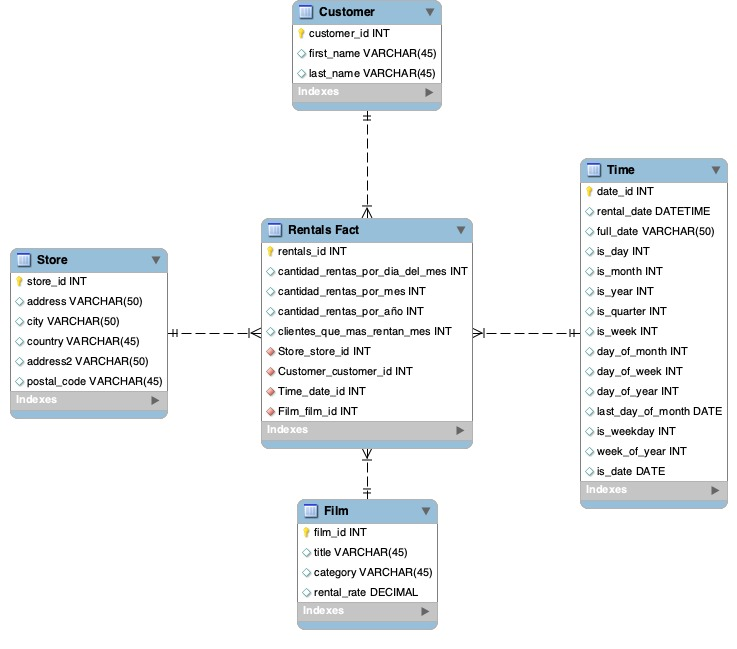

# Gestión de Datos

### Integrantes
* Natalia Arias.
* Felipe Macías.
* Camila White. 

# Proceso ETL

## Extracción

Se tenía como tarea extraer los datos de la tabla country de Sakila y unirlos como un archivo JSON de países obtenido de internet. 
Para lo anterior se realizaron los siguientes pasos:

* Entender la estructura de ambas fuentes: el modelo relacional de Sakila y el archivo .JSON.
* Extraer la información de las fuentes.
* Unirlas.
* Crear la nueva tabla de countries.
* Cargar la nueva información.

Para lo anterior se realizó un script en Python, haciendo uso de Pandas y cursores:

Antes de ejecutar el script verificar:

      Comandos para configuración:
      brew services start mysql --> solo MAC
      mysql -u <myuser> -p --local-infile sakila
      SHOW VARIABLES LIKE 'local_infile'; 
      Si el valor de la variable es falsa, entonces: SET GLOBAL local_infile = 1;

[extraer.py](Extracción/extraer.py)

Después de ejecutar el script, ejecutar las siguientes lineas desde la terminal de MySQL:
    
     LOAD DATA LOCAL INFILE 'newFile.csv' 
     INTO TABLE country2
     COLUMNS TERMINATED BY '\t'
     LINES TERMINATED BY '\n';
     
Por otro lado, se puede crear la tabla country2 en Sakila y ejecutar el siguiente script:

[countries.sql](Extracción/countries.sql)
    
## Transformación

### Agregaciones realizadas sobre Sakila con la nueva tabla de countries

[agregaciones.sql](Transformación/agregaciones.sql)

### Preguntas del negocio generadas
1. ¿Cuál fue el cliente que más rentó por mes en el año 2006?
2. ¿Cuál fue el género de película más rentado en los meses de octubre de cada año?
3. ¿Cuál es el rental_rate de las películas top más rentadas en los últimos 2 años?
4. ¿Qué películas son las que menos se han rentado en los últimos 2 años?
5. ¿En qué fechas del mes se realizan menos rentas de acuerdo a los últimos 3 años?
6. ¿Cuál es la película mas rentada por país en abril del 2005?
7. ¿Cuál es el top 10 de clientes y cuáles son los meses en que ellos menos rentan?
8. ¿Cuáles clientes son los que más han rentado y en qué género?
9. ¿Qué tienda ha tenido el mayor número de rentas en el último año?
10. ¿Cuál es el cliente más fiel (mayor número de rentas por mes)?

### Reglas de transformación (desnormalización)
Tomamos las tablas customer, film y store y tomamos los campos requeridos para responder las preguntas del negocio.
* En customer se extrajeron los campos customer_id, first_name y last_name.
* En Store se extrajo el campo store_id y se desnormalizó address, utilizando solamente los campos address, city y country y se añadieron a la dimensión store.
* De film se extrajeron los campos film_id, title y rental_date, y se desnormalizó la tabla categoría.
* Se creó la dimensión Time y sus campos.

2. Se crearon los campos de la tabla de hechos, entre los cuales se encuentran los que conectan con las dimensiones y los calculados para dar respuesta a las preguntas del negocio.
Los campos calculados fueron:
* Cantidad de rentas por día del mes.
* Cantidad de rentas por mes.
* Cantidad de rentas por año.
* Clientes que más rentan.

## Carga

Se construye el siguiente modelo OLAP con base en Sakila, para dar respuesta a las preguntas del negocio:

        

Para montar el esquema OLAP en MySQL, se hace uso del siguiente script:

[create_schema.sql](Carga/create_schema.sql)

Para poblar el esquema, se hace uso del siguiente script:

[fill_schema.sql](Carga/fill_schema.sql)
